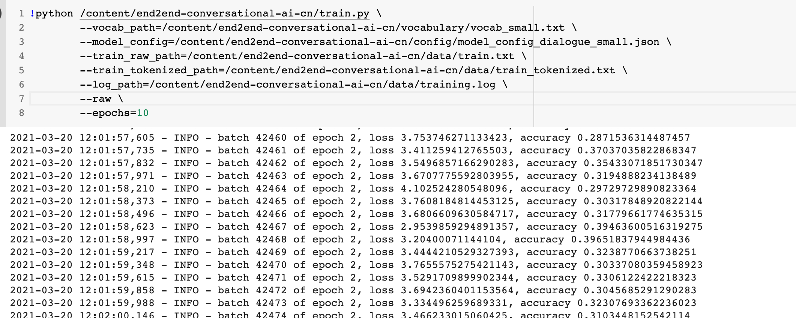
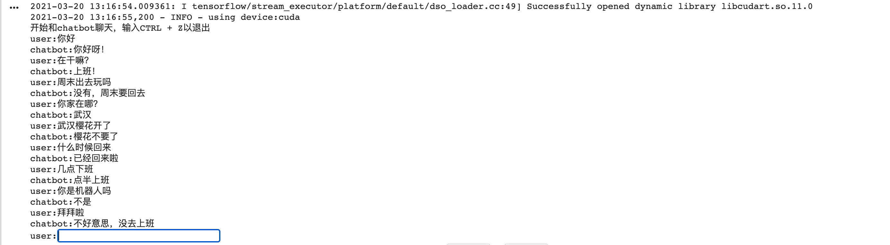
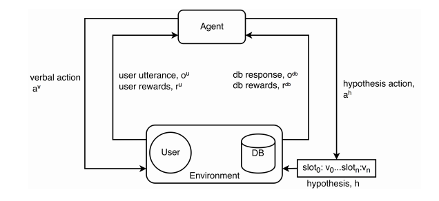

# end2end-conversational-ai

- 实现端到端的对话机器人

- 思考：端到端的对话机器人怎么和强化学习结合

强化学习的学习目标不是来自监督的label，而是来自reward，而反馈可能不能立即到达，基于任务式的对话要到对话片段结束才知道任务是否完成。这时可以建模action的收益为当前的reward，加上后续的经过一定衰减的收益之和。

上图的模型提出了一种端到端强化学习的方法，在对话管理中联合训练对话状态跟踪和对话策略学习，从而更有力地对系统的动作进行优化。